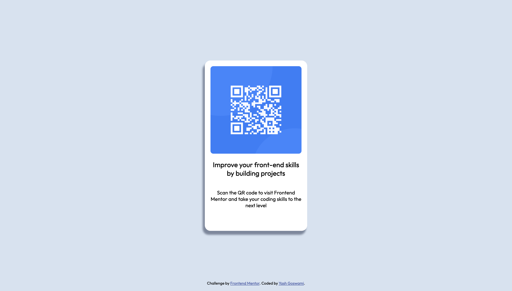

# Frontend Mentor - QR code component solution

This is a solution to the [QR code component challenge on Frontend Mentor](https://www.frontendmentor.io/challenges/qr-code-component-iux_sIO_H). Frontend Mentor challenges help you improve your coding skills by building realistic projects.

## Table of contents

- [Overview](#overview)
  - [Screenshot](#screenshot)
  - [Links](#links)
- [My process](#my-process)
  - [Built with](#built-with)
  - [What I learned](#what-i-learned)
  - [Continued development](#continued-development)
  - [Useful resources](#useful-resources)
- [Author](#author)
- [Acknowledgments](#acknowledgments)

## Overview

### Screenshot



### Links

- Solution URL: [Add solution URL here](https://github.com/Yash-devasp/qr-code-frontend)
- Live Site URL: [Add live site URL here](https://yash-devasp.github.io/qr-code-frontend/)

## My process

### Built with

- Semantic HTML5 markup
- CSS custom properties

### What I learned

It may be a baby step but I learned to center a div on a page. I learned how to add google fonts in a web page. Learned to work with css selectors.

To align every element in the card, I have used Flexbox:

```css
.card {
  display: flex;
  flex-direction: column;
  align-items: center;
  text-align: center;
}
```

### Continued development

I have used flex in the card but I am not sure if this is the correct way to use it and I am planning to extend it further. Also, I am working on grasping the different sizing units as I am still confused where I should use which unit.

### Useful resources

- [How to center a div](https://www.freecodecamp.org/news/how-to-center-anything-with-css-align-a-div-text-and-more/) - This helped me to align the card in the position I wanted it to align.
- [Working with Google fonts](https://www.w3schools.com/css/css_font_google.asp) - This is a well written article by w3school which helped me in understanding how to incorporate the fonts in my web page.

## Author

- Frontend Mentor - [@Yash-devasp](https://www.frontendmentor.io/profile/Yash-devasp)
- Codepen - [@yash-devasp](https://codepen.io/yash-devasp)

## Acknowledgments

This is a project that I worked on my own but I would like to give credit to Ahmed Sadek whose creative css artwork course helped me get over the fear of CSS.
